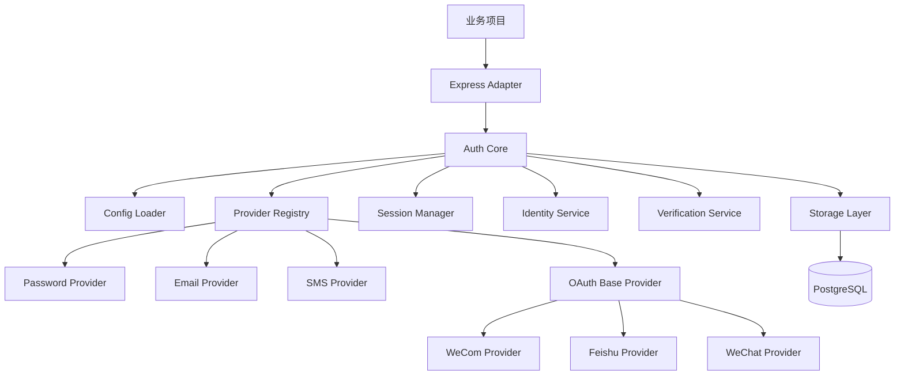

# 阶段一设计稿

## 1. 项目定位

`omni-login-kit` 是一个面向 Node.js 项目的统一登录插件，目标是让开发者通过少量配置快速接入常见登录能力。

首版产品形态不是独立认证中心，也不是企业级 IAM 平台，而是一个可嵌入业务项目的认证模块。

## 2. 解决的问题

业务项目在接入登录能力时，往往会重复实现以下内容：

- 登录方式的路由和回调处理
- 用户、身份、会话、验证码的数据结构
- 第三方 OAuth 的 state、token、用户信息拉取逻辑
- 短信和邮箱验证码发送、过期、频控逻辑
- 账号绑定、首登建号、冲突处理逻辑
- 默认登录页和登录入口

本项目的价值在于，把这些重复工作做成统一的底座和规范。

## 3. 首版目标

首版聚焦于中小型 Web 项目，满足“能快速接入、能覆盖常见场景、能继续扩展”这三个目标。

首期支持：

- 用户名/邮箱/手机号 + 密码
- 短信验证码登录
- 邮箱验证码登录
- 邮箱魔法链接登录
- 企业微信 OAuth 登录
- 飞书 OAuth 登录
- 微信 OAuth 登录

## 4. 首版不做

为避免项目失控，`v0.1.x` 明确不做以下内容：

- 不做独立部署的统一身份中心
- 不做多租户
- 不做 SAML、LDAP、企业级身份编排
- 不做后台管理系统完整版
- 不做所有框架兼容
- 不做所有短信、邮箱服务商全覆盖
- 不做微信全生态形态全覆盖

## 5. 技术决策

| 项目 | 决策 | 说明 |
| --- | --- | --- |
| 运行时 | Node.js 22 LTS | 贴近首版目标用户群体 |
| 开发语言 | TypeScript | 便于约束配置、接口和数据结构 |
| HTTP 适配 | Express | 首版优先支持 Express，后续再扩展 |
| 数据库 | PostgreSQL | 首版主数据库，结构能力强、生态成熟 |
| 会话策略 | JWT + Refresh Session | Access Token 短期有效，Refresh Token 持久化 |
| UI 形态 | 默认托管登录页 + Headless API | 既能开箱即用，也能自定义页面 |
| 配置方式 | `auth.config.ts` + `.env` | 业务配置和敏感信息分离 |

补充说明：

- 首版源码使用 TypeScript 开发，但最终会编译为 JavaScript 产物，方便 JS 项目接入。
- 首版使用 Express 适配器，但核心模块不直接依赖业务路由，后面可以继续加 NestJS 或 Fastify。
- 会话层默认使用 JWT，但 Refresh Token 仍会落库，便于注销、续签和审计。

## 6. 模块架构



### 模块职责

- `Express Adapter`
  - 挂载认证路由
  - 处理 HTTP 请求与响应
  - 暴露中间件给业务项目使用

- `Auth Core`
  - 统一调度登录、绑定、回调、登出等流程
  - 连接配置、Provider、存储和会话模块

- `Provider Registry`
  - 注册和查找已启用 Provider
  - 提供统一入口给 Core 调用

- `Identity Service`
  - 统一处理用户、身份、绑定和冲突合并逻辑

- `Verification Service`
  - 统一处理验证码、魔法链接、发送频控与验证

- `Session Manager`
  - 签发 Access Token
  - 管理 Refresh Session
  - 支持登录态校验和注销

- `Storage Layer`
  - 屏蔽数据库实现细节
  - 为上层提供 Repository 风格接口

## 7. 请求流程概览

### 7.1 本地密码登录

1. 前端提交账号和密码到认证路由。
2. Core 找到 `password` Provider。
3. Provider 校验账号格式和密码。
4. Identity Service 查找对应身份和用户。
5. Session Manager 签发 Access Token 和 Refresh Session。
6. 返回登录结果。

### 7.2 邮箱或短信验证码登录

1. 客户端请求发送验证码。
2. Verification Service 生成验证码并写入存储。
3. 邮件或短信通道发送消息。
4. 客户端提交验证码。
5. Provider 调用 Verification Service 校验。
6. 若用户不存在，则按策略自动注册。
7. 签发登录态。

### 7.3 OAuth 登录

1. 客户端点击第三方登录。
2. Provider 生成授权地址和 `state`。
3. 用户跳转到第三方平台授权。
4. 第三方回调到插件路由。
5. Provider 用 `code` 换取 token 和用户信息。
6. Identity Service 查找或创建绑定关系。
7. Session Manager 签发登录态。

## 8. 首版目录结构草案

```text
omni-login-kit/
├─ docs/
├─ examples/
│  └─ express-basic/
├─ src/
│  ├─ adapters/
│  │  └─ express/
│  ├─ config/
│  ├─ core/
│  ├─ errors/
│  ├─ providers/
│  │  ├─ base/
│  │  ├─ password/
│  │  ├─ email/
│  │  ├─ sms/
│  │  ├─ oauth/
│  │  ├─ wecom/
│  │  ├─ feishu/
│  │  └─ wechat/
│  ├─ services/
│  │  ├─ identity/
│  │  ├─ session/
│  │  └─ verification/
│  ├─ storage/
│  │  ├─ repositories/
│  │  └─ postgres/
│  ├─ types/
│  ├─ ui/
│  └─ utils/
├─ tests/
├─ migrations/
├─ auth.config.example.ts
└─ package.json
```

设计原则：

- `src/core` 只管认证流程，不直接依赖具体 Provider 实现。
- `src/providers` 每种登录方式独立放置，便于扩展和测试。
- `src/services` 放共享业务能力，避免 Provider 里堆业务逻辑。
- `src/storage` 先定义仓储接口，再实现 PostgreSQL 版本。
- `examples/express-basic` 用来演示最小接入方式。

## 9. Provider 接口规范

首版统一使用“Provider 声明 + Provider 实例”模式。

```ts
export type ProviderType =
  | 'password'
  | 'email_code'
  | 'email_magic_link'
  | 'sms'
  | 'wecom'
  | 'feishu'
  | 'wechat';

export interface ProviderContext {
  config: OmniAuthConfig;
  storage: StorageAdapter;
  logger: Logger;
  sessionManager: SessionManager;
}

export interface ProviderAuthResult {
  userId: string;
  identityId: string;
  isNewUser: boolean;
  metadata?: Record<string, unknown>;
}

export interface AuthProvider {
  name: string;
  type: ProviderType;
  initialize(context: ProviderContext): Promise<void>;
}
```

本地账号、验证码类 Provider：

```ts
export interface CredentialProvider extends AuthProvider {
  authenticate(input: Record<string, unknown>): Promise<ProviderAuthResult>;
}
```

OAuth 类 Provider：

```ts
export interface OAuthProvider extends AuthProvider {
  createAuthorizationUrl(input?: Record<string, unknown>): Promise<string>;
  handleCallback(input: {
    code: string;
    state: string;
  }): Promise<ProviderAuthResult>;
}
```

消息发送类 Provider 依赖的通道接口：

```ts
export interface MessageSender {
  send(input: {
    channel: 'email' | 'sms';
    target: string;
    template: string;
    payload: Record<string, string>;
  }): Promise<void>;
}
```

约束原则：

- Provider 只负责本登录方式的接入规则，不直接操作 HTTP。
- 用户创建、账号绑定、会话签发由 Core 和 Service 统一处理。
- 所有 Provider 都必须返回统一的 `ProviderAuthResult`。
- 新增 Provider 时，不允许修改已有 Provider 的公共行为。

## 10. UI 策略

首版 UI 采用“双模式”：

- 托管模式
  - 插件直接提供默认登录页
  - 用户可以快速跑通认证流程

- Headless 模式
  - 插件只提供 API 和回调路由
  - 业务项目自行渲染登录页

默认登录页需要满足：

- 自动根据已启用 Provider 渲染入口
- 支持密码、验证码、第三方登录按钮三大区域
- 支持基础主题变量覆盖
- 支持部分文案和 Logo 配置

## 11. 首版开发边界总结

阶段二开始时，我们默认以下内容已经冻结：

- 项目是内嵌认证插件，不是独立认证中心
- 首版技术栈是 Node.js + TypeScript
- 首版后端适配优先 Express
- 首版数据库优先 PostgreSQL
- 首版会话策略采用 JWT + Refresh Session
- 首版 UI 同时支持默认托管页和 Headless API
- Provider 通过统一接口接入
- 配置通过 `auth.config.ts` 统一声明

## 12. 下一阶段直接开工项

阶段二按以下顺序推进最稳妥：

1. 初始化 TypeScript 工程和目录结构
2. 定义核心类型、Provider 接口和配置校验
3. 搭建 Express Adapter 与基础路由
4. 搭建 Storage Repository 接口
5. 实现 Session Manager 和 Error 系统
